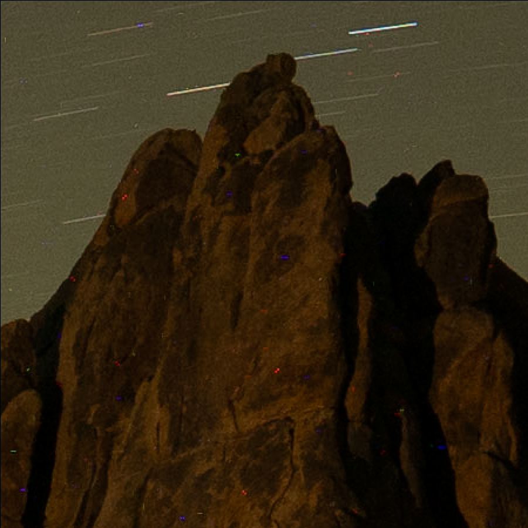
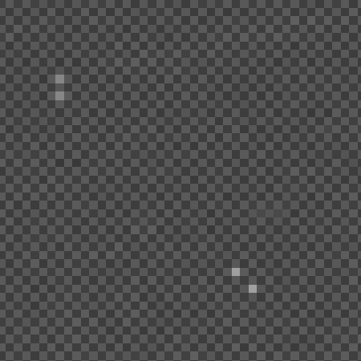
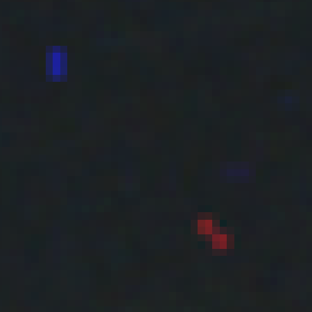
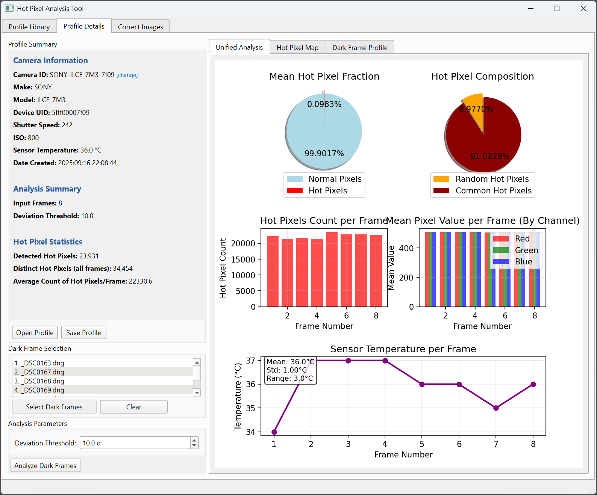
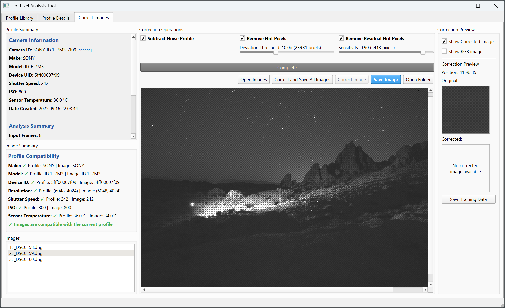
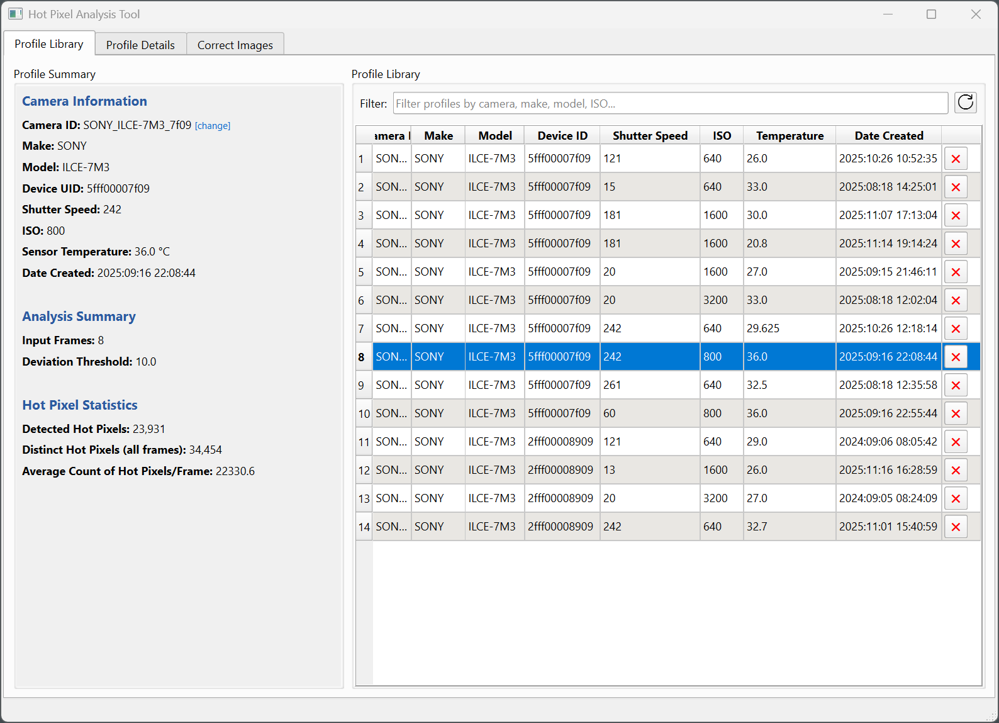

# HotPixels

## Overview

HotPixels removes hot pixel noise from long exposure images using dark frame profiles and machine learning. It Works on RAW DNG files to minimize correction artifacts. It integrates with Lightroom as a plugin.

Hot pixels are erroneously high pixel values that appear as bright red, green, or blue spots. They're consistent across frames from the same sensor.

## Examples

Before Correction             |  After Correction
:-------------------------:|:-------------------------:
  |  

## Why Correct RAW Images?

Hot pixels in RAW data appear as single bright pixels. When RAW images are processed, during demosaicing, these bloom into colored blobs affecting surrounding pixels. If we fix them in the raw image, the overall impact is minimized.

Raw Hot Pixels             |  Processed Hot Pixels
:-------------------------:|:-------------------------:
  |  


## Features

#### Create Profiles from Dark Frames

Shoot dark frames (lens cap on) and analyze to identify persistent hot pixels. Profiles include sensor metadata (ISO, shutter speed, temperature) for matching to target images.



#### Correction Methods

Three correction stages:

1. **Subtract Dark Frame**: Remove noise floor using mean dark frame
2. **Remove Hot Pixels**: Replace hot pixels with interpolated values  
3. **Residual Hot Pixel Detection**: Neural network detects remaining random hot pixels



#### Profile Library

Manage profiles for different cameras, settings, and temperatures. Auto-matches profiles to target images.



## Usage

Clone this repository or [download the zip](https://github.com/gkyle/hotpixels/archive/refs/heads/main.zip) and uncompress on your system.

**Windows:**
```
run.bat
```

**Linux/macOS:**
```
./run.sh
```

Creates a Python virtual environment and installs dependencies. Detects CUDA GPU if available.

## Lightroom Integration

Install and run the application from the install location once. This is needed to capture and store the install location for Lightroom. Open Lightroom. Navigate to File > Plug-in Manager. Click Add.

Navigate to the install location and select the hotpixel.lrdevplugin” folder.

After the plug-in is installed, it can be accessed from:

File > Plug-in Extras > Hot Pixels

## Platform Support

| Platform |  Status |
|----------|--------------|
| Windows  | ✅ Supported |
| macOS    | ✅ Supported |
| Linux    | ⏳ Not yet |

## Dependencies

This project relies on a couple of complex dependencies:
- dngio: A library for reading / writing DNG files. Currently supports Windows and Mac.
- exiftool: An excellent tool for extracting EXIF data from images. It is uniquely capable of extracting vendor-specific tags from DNG files. This is a Perl application that is automatically fetched and installed, if not already present on system.
